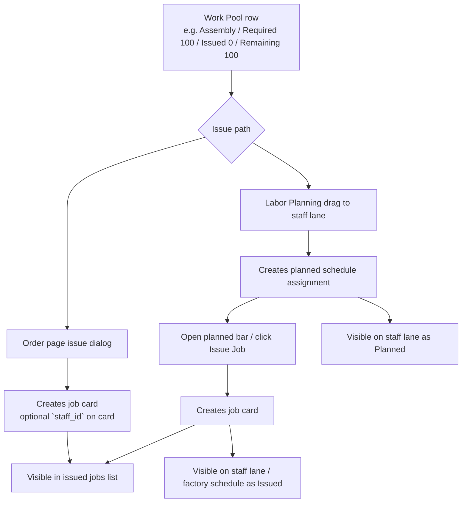
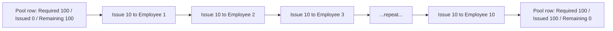

**Orders Master**

- **Scope:** Customer orders (sales orders) domain: schema, UI, storage, and links to Purchasing.
- **Audience:** Developers and operations.
- **Status:** Current implementation overview with cleanup guidance for test/dev.

**Core Tables**

- `orders`: Header containing `order_id`, `customer_id`, `order_date`, `status_id`, `order_number`, timestamps, optional `delivery_date`. See `schema.txt:114` (orders + statuses).
- `order_statuses`: Canonical order workflow names (e.g., New, In Progress, Completed, Cancelled).
- `order_details`: Lines: `order_detail_id`, `order_id`, `product_id`, `quantity`, `unit_price`, planned `selected_options` JSONB for configurable products (parity with `quote_items`).
- `order_attachments`: Attachment metadata (DB record) with `file_url`, `file_name`, `uploaded_at`. Storage files live in the Supabase Storage bucket (see below).
- `customers`: Linked via `customer_id`.

**Supabase Storage (Attachments)**

- Bucket: `qbutton` (lowercase in code).
- Upload path pattern: `Orders/Customer/<customer_id>/<filename>`.
- Public URL is stored in `order_attachments.file_url` after upload.
- UI for listing/uploading attachments lives in `app/orders/page.tsx`:
  - Upload uses `UploadAttachmentDialog` which writes to Supabase Storage and inserts a row in `order_attachments`.
  - Listing pulls from `order_attachments` via a React Query (`['orderAttachments', order_id]`).
  - A helper `listCustomerFiles(customerId)` exists but is not currently used by the Orders UI.

**Quick‑Open Attachments (from Product page)**

- The Product page FG reservations dialog (see `app/products/[productId]/page.tsx`) shows per‑order rows when a product is reserved.
- For each order, we fetch the latest record from `order_attachments` and provide an “Open PDF” link.
- This path is read‑only and intended for fast reference while reviewing finished‑goods availability.

**FG Reservations – API Recap**

- Server routes under `app/api/orders/[orderId]/` wrap the FG RPCs:
  - `POST reserve-fg` → `reserve_finished_goods(p_order_id)`
  - `POST release-fg` → `release_finished_goods(p_order_id)`
  - `POST consume-fg` → `consume_finished_goods(p_order_id)`
- Read route:
  - `GET fg-reservations` → reads `product_reservations` then merges product info.

**Component Reservations (Raw Material Earmarking)**

- Earmarks on-hand raw materials/components for a specific order so other orders see reduced available stock.
- Table: `component_reservations` (`order_id`, `component_id`, `qty_reserved`, `org_id`; unique on `order_id + component_id`).
- RPCs:
  - `reserve_order_components(p_order_id, p_org_id)` — idempotent: deletes existing reservations, then inserts new ones based on current BOM requirements vs available stock (minus other orders' reservations). Safe to re-run when stock changes.
  - `release_order_components(p_order_id, p_org_id)` — deletes all reservations for the order.
- API routes (same auth pattern as FG):
  - `POST /api/orders/[orderId]/reserve-components`
  - `POST /api/orders/[orderId]/release-components`
- Auto-release trigger: reservations are deleted when an order moves to Completed or Cancelled (`trg_auto_release_component_reservations`).
- Shortfall math: per-order `apparent_shortfall` and `real_shortfall` in `get_detailed_component_status` use `in_stock - reserved_by_others` as available stock. Global shortfalls are unchanged (reservations redistribute existing stock, they don't change totals).
- UI: Reserve/Release buttons on Order Detail page; BOM table shows RESERVED column (blue when > 0); component detail Transactions tab hero card shows "X reserved · Y available" when reservations exist.
- Migrations: `20260303085534` through `20260303151451` (7 files, see `supabase/migrations/`).

**UI & Routes**

- Orders list: status filter, debounced search (order number, customer name, numeric ID), section chips, attachment count, upload dialog.
  - List page: `app/orders/page.tsx`
  - Detail page: `app/orders/[orderId]/page.tsx`
  - New order (scaffolded): `app/orders/new/page.tsx`
  - Orders layout: `app/orders/layout.tsx`
  - A bypass page also exists: `app/bypass/orders/page.tsx`
  - Each table row is hover/focus interactive and navigates directly to the detail view (chevron indicator replaces the previous "View Details" text link).
  - Delivery Date is inline-editable from the list table: click the date (or "Set date"), choose a calendar day, and the UI updates `orders.delivery_date` via `PATCH /api/orders/[orderId]` (organization-scoped access enforced server-side). The popover closes immediately on selection while the list applies an optimistic date update for snappier feedback, then rolls back with a destructive toast if the server rejects the change.
  - Attachment counts render as pill buttons with improved hover/focus treatment; Upload and Delete controls stop event propagation so row clicks do not trigger unintentionally.
  - The delete action is now an icon-only circular control (`aria-label` supplied) to declutter the actions column while keeping the tooltip/title.
  - Expanded list rows show the ordered product names and quantities directly instead of only a product-count summary. If a line has cutlist material selections, the row also summarizes the selected material names beneath the product.
  - The order-line cutlist material dialog shows each customized part's finished thickness beside the part name (`16mm`, `32mm + backer`, or `32mm laminated`) so operators can match the correct edging width while keeping the selected board material unchanged.
  - The Client Order products table intentionally omits material-cost estimates; costing stays on the cutting-plan/costing surfaces so the order page remains focused on client order quantities, status, and totals.

**Data Fetching & Filters (List Page)**

- Query selects `orders` with nested relations: `status:order_statuses`, `customer:customers`, and `details:order_details(product:products)`; sorted by `created_at` desc.
- Status filter resolves `status_id` by `order_statuses.status_name` and filters on the header.
- Search builds an `.or(...)` clause combining:
  - `customer_id.in.(<ids matching customers.name ilike %term%>)`
  - `order_number.ilike.%<term>%`
  - `order_id.eq.<numericTerm>` (when the term parses as an int)
- Section chips are heuristic: `determineProductSections(product)` matches keywords in `product.name/description` to map to `chair`, `wood`, `steel`, `powdercoating`.
- Status badges use a local map to colors: New, In Progress, Completed, Cancelled (fallback to gray).

**Order Detail & Purchasing Linkage**

- Detail page `app/orders/[orderId]/page.tsx` loads header (`orders` with `order_statuses`, `customers`, and `quotes`) plus `order_details(product:products)`. For configurable products, extend the line editor to surface option selectors sourced from attached **Option Sets** (global + product overlays), persist `selected_options`, and call the shared resolver so FG reservations and purchasing respect the chosen configuration even when an order is created directly (no quote).
- Product swap and surcharge support extends `order_details.bom_snapshot` with explicit effective fields, `swap_kind`, removed-row semantics, and per-row surcharge metadata. `order_details.surcharge_total` stores the summed commercial surcharge independently of base line price; order totals trigger work is tracked separately from the snapshot/schema phase.
- Cutlist costing follows the same snapshot rule: `order_details.cutlist_costing_snapshot` stores the product-level `product_cutlist_costing_snapshots.snapshot_data` as it existed when the product became an order line. Product **Save to Costing** is a template update for future order lines only; existing order material-cost fallback must use the frozen order-line snapshot unless the row predates this column.
- In the order detail Products tab, expanding a line's BOM panel exposes the swap action for snapshot-backed BOM rows. Operators can choose another same-category component or remove the row, enter a positive/zero/negative surcharge, and save the paired `bom_snapshot` + `surcharge_total` update so the order total trigger recalculates the header total.
- In the order detail Products tab, snapshot-backed cutlist lines expose a **Cutlist material** action beside the product summary. Operators can set the line's primary board, paired edging, fixed/percentage surcharge, and per-part board/edging overrides. The save path writes the cutlist material intent columns and rebuilds `cutlist_material_snapshot`; the database trigger recomputes `cutlist_surcharge_resolved` and `surcharge_total`.
- In the order detail Cutting Plan tab, each Material Breakdown row exposes cutter cut-list PDF print actions once a generated plan is current and part labels are loaded. Non-backer material groups produce one `Print Cut List` PDF; backer groups produce separate `Print Primary` and `Print Backer` PDFs so primary and backer materials can be cut independently. See [`../../plans/2026-05-05-cutter-diagram-print.md`](../../plans/2026-05-05-cutter-diagram-print.md).
- In the order detail Cutting Plan tab, Material Assignments collapse behind a compact outline button once a generated plan exists, keeping the nested material breakdown visible first while still showing the assigned/total role count on the trigger.
- The order-detail header tab counts now query live order totals for job cards, purchase-order lines, and stock issuances instead of rendering placeholder zeros. Finished-goods reservation reads and reserve/release/consume actions use authenticated order API requests so the detail page can load under the same organization-scoped access checks as other order mutations.
- **Stock Issuance** (✅ Implemented January 2025):
  - "Issue Stock" tab on Order Detail page (`IssueStockTab` component)
  - BOM-integrated component selection and aggregation
  - Product-level selection with independent order detail control
  - Automatic quantity prepopulation based on BOM requirements
  - Product-level "Issue units" control for staff-split work: operators can enter the number of finished units being issued in the current batch, and the tab scales each selected BOM component from the order-line requirement while still allowing per-component quantity overrides before issuing.
  - Saved cutting plans expose a separate **Cutting List Board Stock** issue area in the same tab. Primary/backer board sheets are aggregated from `orders.cutting_plan.material_groups`, can be selected and issued independently with the section's `Issue Boards` action, and share the existing stock issuance history/reversal path. Stale cutting plans are shown but disabled until regenerated.
  - Real-time inventory availability checking
  - "All components issued" visual indicators (badges and card highlighting)
  - PDF generation with signature fields for physical signing
  - Issuance history tracking via `stock_issuances` table
  - Supports partial issuance, multiple products, and component aggregation
  - Reversible via `reverse_stock_issuance` RPC. The Issue Stock tab nets `stock_issuance_reversals.quantity_reversed` against each issuance so Required stays fixed, Issued/Issue Qty/Issue units recalculate from the remaining un-reversed quantity, and fully reversed rows no longer count as issued.
  - See [`../changelogs/stock-issuance-implementation-20250104.md`](../changelogs/stock-issuance-implementation-20250104.md) for details
- Component requirements pipeline:
  - RPC: `get_all_component_requirements` to compute global totals.
  - RPC: `get_detailed_component_status(p_order_id)` for per-order requirements with stock/on-order and global fields.
  - RPC: `get_order_component_history(p_order_id)` for per-component historical context.
  - The Components Summary merges BOM-derived rows with any additional rows returned by `get_detailed_component_status(p_order_id)`, so cutting-plan material demand such as sheet boards and edging appears in the order summary even when those components are not part of the product BOM.
  - UI summary now distinguishes **Ready Now** (fully covered by on-hand stock) vs **Pending Deliveries** (covered only once outstanding supplier orders arrive). When any component is pending deliveries, the Components Summary card swaps the "All components available in stock" badge for an amber warning explaining that availability depends on incoming receipts, and it shows the count of affected components so planners know what must arrive before issuing stock.
  - In the Order Components procurement dialog, toggling `Include in-stock` keeps any user-entered PO quantity and allocation for already listed rows; only newly revealed rows initialize from the computed default shortfall/allocation.
- Suppliers & PO creation:
  - Suppliers fetched from `suppliercomponents` (with supplier emails joined from `supplier_emails`).
  - Components grouped by supplier; user selects components and quantities, and can allocate between "For this order" vs "For stock".
  - **Global Shortfall Ordering**: Component ordering is available when either per-order OR global shortfalls exist. When a component has only a global shortfall (no per-order shortfall due to FG coverage), the "Order Components" dialog displays it with a "For Stock" badge and defaults allocation to stock rather than the current order.
  - **Smart Allocation Defaults**:
    - Components with per-order shortfall: Default allocation to "For this order" (quantity_for_order)
    - Components with only global shortfall: Default allocation to "For stock" (quantity_for_stock)
    - All allocations are user-adjustable before creating the purchase order
  - PO creation looks up `Draft` in `supplier_order_statuses`, inserts into `purchase_orders` and `supplier_orders`, then links each supplier order line to the sales order via `supplier_order_customer_orders` with `quantity_for_order` and `quantity_for_stock`.
  - **Future Enhancement**: Track allocation/earmarking of ordered stock to specific orders for better visibility into what stock is intended for which orders.

**API Routes**

- `app/api/orders/[orderId]/add-products/route.ts` inserts `order_details` rows in bulk. It freezes BOM, cutlist material, and cutlist costing snapshots onto each new row. The database `order_details_total_update_trigger` recomputes `orders.total_amount`, including any `order_details.surcharge_total`. Validates `order_id` and request shape.

**Types & DB Utilities**

- Types: `types/orders.ts` defines `Order`, `OrderDetail`, `OrderAttachment`, `Customer`, `OrderStatus`. `Order` uses `order_id` (number) and includes optional `quote` summary.
- DB helpers: `lib/db/orders.ts` defines minimal `createOrder(order)` and `fetchOrders()`. Note: the `Order` interface here uses `id` instead of `order_id` and `quote_id` as string — this differs from `types/orders.ts` and the actual `orders` table.

**Known Gaps / Inconsistencies**

- `lib/db/orders.ts` shape vs runtime:
  - Uses `id` (string) while UI and DB use `order_id` (number). The New Order page navigates with `router.push(\`/orders/${order.id}\`)`, which will be incorrect if Supabase returns `order_id`. Align types and navigation.
- The New Order form is a scaffold; real customer/product selection and header creation are not implemented yet. Current flow prefers creating an order from a Quote (`quote_id`).
- Configurable products: direct order entry does not yet capture option selections. Need to reuse the quote option UI backed by the new option set catalog, persist `selected_options` on `order_details`, and update BOM/reservation logic to honor the configuration without requiring a quote.
- Section chips are heuristic and based on product text; consider explicit product → section metadata.
- Attachments listing relies on `order_attachments`; a storage listing helper exists but is not used. Ensure DB rows are the source of truth to avoid drift.

**Next Steps — Configurable Products Parity**
- Add `selected_options` persistence to `order_details` (column/migration + API updates).
- Reuse `resolveProductConfiguration` when adding or editing products on an order so BOM/FG reservations reflect option choices.
- Display configuration summary chips in the order detail UI and include selections in PDFs/emails to match the quoting experience.

**Cleanup & Reset**

- See `docs/domains/orders/orders-reset-guide.md` for test/dev cleanup.
- Helper scripts: `scripts/cleanup-orders.ts` and `scripts/cleanup-purchasing.ts` can be used to reset data; Purchasing can be cleaned independently (see `docs/domains/purchasing/purchasing-reset-guide.md`).

**Related Schema References**

- Orders domain: `schema.txt` (orders + statuses around line 114 in the snapshot).
- Junction table linking supplier orders to customer orders: `sql/create_junction_table.sql` (table: `supplier_order_customer_orders`).

**Link to Purchasing**

- There is no direct FK from `orders` to `purchase_orders`.
- When generating POs from an order, each supplier order line is linked via junction `supplier_order_customer_orders` containing:
  - `supplier_order_id` (SO), `order_id` (sales order), `component_id`, `quantity_for_order`, `quantity_for_stock`.
  - Schema: `sql/create_junction_table.sql`.
- Component requirement functions (`get_order_component_status`, `get_detailed_component_status`, `get_global_component_requirements`) treat every order status except **Completed** and **Cancelled** as "active". Newly created orders stay visible to purchasing immediately, without needing a status transition.

**Cleanup Considerations**

- If you delete orders, you should also:
  - Remove `supplier_order_customer_orders` rows referencing those orders (to avoid dangling links in Purchasing).
  - Delete `order_attachments` DB rows and delete the corresponding storage files under `qbutton/Orders/Customer/<customer_id>/`.
  - Delete `order_details` rows before deleting the `orders` headers.
  - Refresh component views if you use them to compute requirements: `SELECT refresh_component_views();`.
- Purchasing can be cleaned independently (see `docs/domains/purchasing/purchasing-reset-guide.md`). If you do not also delete POs, the POs and supplier orders remain but will no longer be linked to any order.
- After inserting, updating, or deleting supplier orders directly (outside the UI workflow), run `SELECT refresh_component_views();` so the materialized views feeding the order component dashboards pick up the latest "On Order" quantities.

**Recommended Status Workflow**

- New → In Progress → Completed or Cancelled.
- Cancel instead of delete in production to preserve auditability. For test/dev, see `docs/domains/orders/orders-reset-guide.md` for a safe deletion path.

**Job Cards / Work Pool (Current Model)**

- The current job-card flow is two-stage:
  1. create or refresh demand in the `Work Pool`
  2. issue job cards out of that pool
- `Generate from BOL` on the order page no longer creates job cards directly. It snapshots BOL demand into `job_work_pool`.
- When every current BOL row already has a matching work-pool snapshot, the `Generate from BOL` button is disabled and shows the tooltip `Bill of Labor in sync already`.
- `Add Job` on the order page creates a manual `job_work_pool` row (`source='manual'`), so manual jobs and BOL jobs use the same issuance flow.
- `Required` = the snapped demand quantity on the pool row.
- `Issued` = the sum of non-cancelled `job_card_items.quantity` linked to that pool row.
- `Remaining` = `Required - Issued`. It is computed, not stored.
- Pool rows are snapshots. If the order quantity or BOL changes later, the order page warns that the pool is stale and offers `Update Pool` reconciliation. After a successful reconcile, the warning should clear when the refreshed pool matches current demand.
- Partial-completion follow-up cards do not change the issued math for the original pool row; work-pool issuance/counting always resolves through the item's original `job_card_id`.

```mermaid
flowchart LR
    A["Order line<br/>quantity on `order_details`"] --> B["Product BOL<br/>jobs + qty/pay type/rates"]
    B --> C["Generate from BOL"]
    C --> D["`job_work_pool` rows<br/>one row per order detail + BOL job"]
    E["Add Job"] --> F["Manual `job_work_pool` row"]
    D --> G["Work Pool on Order page"]
    F --> G
    G --> H["Issue from Order page"]
    G --> I["Drag onto Labor Planning lane"]
    I --> M["Create `labor_plan_assignments` planned row"]
    M --> N["Open planned assignment on lane"]
    N --> J["Issue Job from lane modal"]
    H --> J["`issue_job_card_from_pool` RPC"]
    J --> K["Create `job_cards` row"]
    J --> L["Create linked `job_card_items` row<br/>with `work_pool_id`"]
    K --> O["Job Card detail / mobile scan"]
    L --> O
    O --> P["Complete / cancel"]
    P --> Q["Completed qty, payroll, production status"]
```

**Where to issue from**

- Use the **Labor Planning Board** when you already know which employee should get the work and when it should happen, but you may still want to move the slot later. Dragging the pool job onto a staff lane now creates a **planned** scheduler assignment only. When you are ready to release the work, open that planned bar, choose the issue quantity, optionally tick `Print job card after issue`, and click `Issue Job`.
- Use the **Order page Job Cards tab** when you want to convert pool demand into a job card without scheduling it yet, or when you want an ad hoc card quickly. This issues the card, but it does **not** create the scheduler assignment.
- Current model is still **one staff member per job card**. Team / multi-staff cards are deferred.



**100 items to 10 employees**

- The system supports this as **10 separate issued cards** of quantity `10` each against the same pool row.
- After each issue:
  - `Issued` increases by `10`
  - `Remaining` drops by `10`
  - the new card is independently trackable for start, completion, cancellation, and piecework value
- After the tenth issue, that pool row becomes `Fully Issued` (`Remaining = 0`).
- There is no current bulk "split 100 evenly across 10 employees" action. You issue the ten splits one by one.



**Operational rules**

- Over-issuing is blocked by default. A user can override it with a reason, and the system creates an acknowledged production exception tied to the pool row.
- Cancelling a job card removes that card/item from the computed issued total, so the quantity effectively returns to pool availability.
- Completed cards still count as issued work; only cancelled cards/items are excluded from issued totals.
- Removing an order product line is preflighted against `job_work_pool` rows that still reference that line. The delete dialog lists the linked work-pool jobs, required/issued quantities, and whether job-card items exist. If no job-card items have ever been issued from those rows, the user can explicitly clear the generated work and remove the product in one step. If any job-card items exist, deletion is blocked with a structured `409` (`ORDER_DETAIL_HAS_ISSUED_JOB_CARDS`) until the linked job-card work is cancelled/reversed; the route never silently deletes production work or falls through to a raw FK error.
- The same product-line delete preflight checks components used by the line. If those components have order-level reservations, active supplier-order allocations, allocation receipts, or stock issuances tied to the order, deletion is blocked with `ORDER_DETAIL_HAS_COMPONENT_ACTIVITY` and the dialog lists the affected component rows. Because purchasing, reservation, and stock-issue records are linked to the order/component rather than an individual order-detail row, users must review and adjust those component records before removing the product.
- Scheduler demand now comes from the work pool when pool rows exist for the order. Legacy orders without pool rows still fall back to raw BOL/job-card behavior.

**Recommended day-to-day usage**

1. Confirm the order lines and BOL are correct.
2. Run `Generate from BOL` so the work pool reflects current demand.
3. Use the **Labor Planning Board** to drag pool demand to employees and place the work as **Planned**.
4. When the plan is confirmed, open the planned bar on the lane, set the issue quantity if needed, optionally tick `Print job card after issue`, and click `Issue Job`.
5. Let staff complete work from the job-card page or scan page.
   On the mobile scan page, newly issued cards are presented to workers as `Issued` (even though the underlying card status is still `pending`) and the primary action is `Complete Job`.
   There is no separate `Start Job` step on the scan page; quantity capture and completion happen directly from the mobile job-card workflow, while supervisors can still adjust timings elsewhere when needed.
   Completion from the card page or scan page now syncs only the exact card-backed scheduler assignment, so split-issued siblings on the same order/staff/job are not accidentally completed together.
6. If order quantities change after issuance, reconcile the stale pool warning and then deal with any resulting exception rows.
