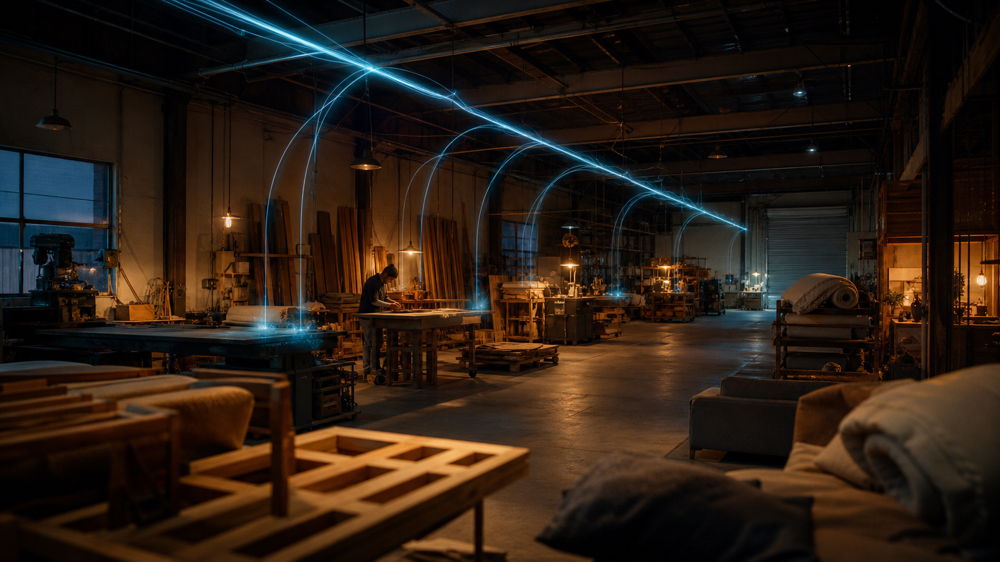
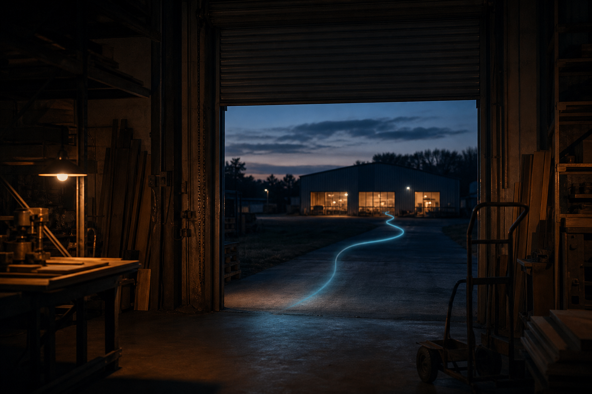
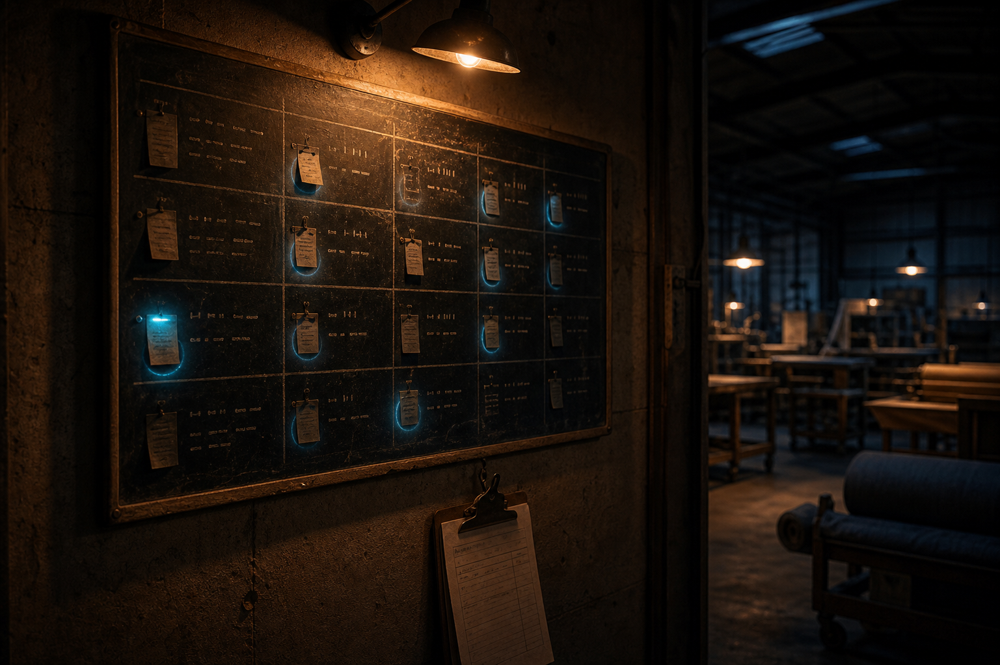

<!--
ADVERT DRAFT — client-facing pitch document (the "advert")
=========================================================
Internal notes (strip before export):
- This is the client-facing, sales advert version. Companion strategy doc:
  docs/pitch/nervous-system-positioning.md (internal — never share).
- Reader is an owner / MD / operations director who saw the demo.
- Pricing intentionally deferred — placeholder section left for later.
- Image slots refer to the 7 image prompts in the positioning doc workflow.
- Working title — Greg to pick before export.

Image roster (locks deck visual coherence):
  01 — Hero "factory paying attention"           [generated ✓]
  02 — Cover/quiet (chair frame + tendril)       [pending]
  03 — Won't-let-go (hand + tendril)             [pending]
  04 — Receiving vignette                        [pending]
  05 — Inter-site Transfer vignette              [pending]
  06 — Daily Brief vignette                      [pending]
  07 — Diptych (before / after)                  [pending]
  08 — Exception Triage vignette  [NEW — prompt below in this doc]
-->

# Tight Factories

### Unity ERP for manufacturers — and the agents that make it real.

> Your ERP is the spine. We are the nervous system.

---

## What an ERP doesn't notice

Your ERP holds your factory upright. It records what happened. It tells you what you have, what you owe, what's open.

What it doesn't do is **notice**.

It doesn't notice the four oak boards that arrived but never made it onto a goods-received note.

It doesn't notice that the steel frame for tomorrow's order left the fab shop yesterday but never arrived in upholstery.

It doesn't notice that the customer whose chair is "almost ready" has been hearing "almost ready" for three days.

It doesn't notice that the clock-in at 04:47 on Tuesday morning was the same person whose phone you found on the bench at 16:00.

People are supposed to notice these things. And they do — most of the time. Until the phone rings, or someone's off sick, or three things happen at once. Then balls drop. Not because anyone's bad. Because they're human.

---

## What we add

We add a **nervous system**.

Agents that watch every signal in your business and won't let anything go until it's closed. They notice the unrecepted board. They notice the steel frame that left but didn't arrive. They notice the customer who's been waiting too long. They notice the clock-in anomaly before payroll runs on Friday.

They don't forget. They don't take lunch. They don't get distracted.

They notice. They push. They escalate. They close.

That's what makes a factory tight.

---

## The four nerves we install first

Each one is a thing that won't let go. Each one creates an audit trail you can read later. None of them speak unless they have something useful to say.

### Receiving & Match

Photograph a delivery note on Telegram. The agent reads it, checks it against the open purchase order, and flags any line that doesn't match — short, over, or wrong revision.

The unmatched lines stay open and re-surface every shift until they're reconciled. Four boards delivered but never received? They show up in tomorrow's morning brief, and the next one, and the next one, until they're either booked into stock or written off.

### Inter-Building Transfer

Whenever a component leaves one part of the factory for another — between buildings, between bays, between a store and the floor — the dispatch is logged with a photo. The receipt is acknowledged at the other end.

If the transfer leaves but never arrives, the agent flags it after thirty minutes. After two hours, your supervisor gets a name. By the next morning brief, it's at the top of the list. Even a hundred-metre walk between buildings is something the system now watches.

### Production Exception Triage

Every blocker on your shop floor — shortage, awaiting transfer, quality hold, labour unavailable, supplier late, engineering question — gets an owner, an age, and a status.

Old blockers escalate. Resolved blockers post a closure note. Nothing rots. When a supervisor asks "why is this job still sitting here?" the answer is in the system, not in someone's head.

### Daily Control-Tower Brief

Every morning, one Telegram message. Late purchase orders. Stuck transfers. Blocked jobs. Payroll anomalies. Customer orders past their internal ETA. Each section shows the count, the worst offender, and the age.

The list shrinks day-over-day, or someone gets called.

It is the most visible proof that the nervous system is real. You wake up, you read the brief, and you can see that the agents have been working all night.

---

## What the same factory looks like, with and without

The body is the same. The work is the same. The people are the same.

What's different is whether anything is paying attention when nobody else is.

---

## What the first ninety days looks like

We don't ship a year-long ERP project. We ship a tight ninety-day pilot that proves the four agents can take real work off your team and that the brief lands every morning.

| Weeks | What we do | What you see |
|---|---|---|
| 1–2 | On-site walk-through, both buildings. Process map. Pilot scope. Baseline measurements. | A clear picture of where time is being lost today. |
| 3–4 | Receiving workflow live for pilot suppliers. Item master and PO data scoped. | Your first delivery notes flowing through the agent. |
| 5–6 | Inter-building transfers live. Blocker taxonomy agreed with your supervisors. | Steel-to-upholstery handoffs digitally logged. |
| 7–9 | Production Exception Triage live. Daily Control-Tower Brief live. | One Telegram message every morning that you read in five seconds. |
| 10–12 | Tuning, quiet hours, escalation thresholds, false-positive sweep. | The agents stop saying things that don't matter. |
| 13 | Pilot review against the baseline. Decision on phase two. | Honest numbers — where it worked, where it didn't, what's next. |

---

## What we don't do

We are not as broad as Epicor. We are not as deep on furniture engineering as imos. We are not a generic AI copilot you can ask anything.

We do one thing: we make the factory you already have **noticeably tighter**, by putting agents on top of a manufacturing-first ERP, and by giving those agents the discipline to drive things to closure rather than chat about them.

We don't replace what you already have. We make it watch over itself.

---

## What happens next

- **A thirty-minute call** to make sure there's a real fit.
- If yes, **a two-hour onboarding workshop**, on site, both buildings, with the people who'll actually be using it.
- Then **a fixed-price ninety-day pilot** with the four agents above.

Pricing for the pilot and ongoing subscription is on the next page.

---

## Pricing

*[To be drafted — Polygon to set figures.]*

---

## Polygon

Unity ERP. Matt-style agents. Made for manufacturers who want their factory to stay tight.

[Contact details — Polygon to add]

<!--
PROMPT FOR IMAGE 08 — Exception Triage vignette
================================================
[Style block — paste verbatim, same as image 01]
Style: cinematic dusk photography of a working furniture factory floor —
warm-lit, slightly analog and nostalgic. Palette: deep charcoal-blue
ambient (#0E141C), warm amber from sodium and incandescent work-lights
(#E8A249), pale cyan signal trails (#7FE4F5) that read like long-exposure
light traces — soft, glowing, never laser-sharp. Generous negative space.
No on-screen text, no UI graphics, no logos, no brand names. People
appear quiet, focused, mid-task — never posed or staged. Real wood, real
steel, real fabric. Subtle film grain. Mood: calm, late-shift, confident,
the room is paying attention.

Scene: a weathered chalkboard or notice board mounted on a workshop wall,
hand-written job numbers and short notes pinned or chalked across it.
Some entries have a soft cyan halo around them — these are the items the
agent is currently watching. One entry has a brighter cyan pulse, as if
it has just aged past its SLA. A clipboard hangs on a hook below the
board. The board is lit by a single warm amber work-light from above-left.
The rest of the workshop is in soft shadow behind. No people in frame.
Composition: board occupies left two-thirds, right third is shadowed
workshop with negative space.
-->
