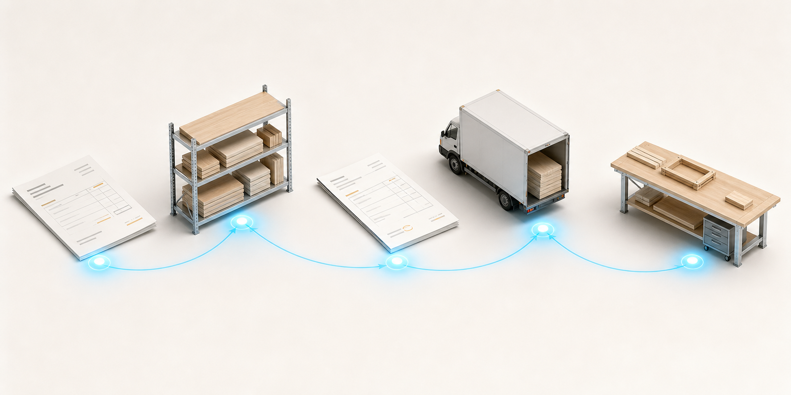
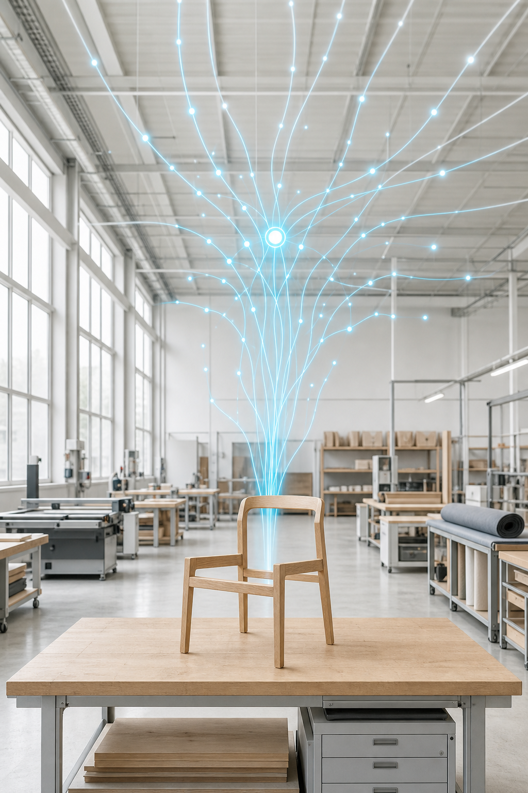

<!-- _class: cover -->

# The Purchasing Agent

*What your AI agent actually does, hour by hour.*

---

<!-- _class: quote-only -->

# Four questions your agent watches every day.

Which customer orders won't ship — because we haven't placed the POs yet?

Which POs are running late — and what jobs do they put at risk?

Which deliveries arrived but don't match what we ordered?

Where is stock quietly disappearing?

---

<!-- _class: flow -->

# The cycle, end-to-end.

Five stages. Five points where things slip without notice. Five points your agent watches.

---

> ## "Three customer orders won't ship next week unless POs go out today."

At 5:30 a.m., your agent scans every open customer order against the BOM, current stock, and supplier lead times.
→ Three orders are short. Drafts ready. Waiting for your nod on the buyer's screen.

---

> ## "PO Q26-779 was due Tuesday. Job J401 slips Friday unless it lands."

Your agent tracks every open PO against its expected delivery and the jobs that depend on it.
→ Eight days overdue. Supplier chased twice. Manufacturing impact already on tomorrow's brief.

---

> ## "Four oak boards arrived. None of them made it onto a goods-received note."

A delivery note photograph arrives via Telegram. Your agent reads it, matches each line to the open PO, books receipts on clean lines, opens exceptions on the rest.
→ Short deliveries. Incorrect captures. Surfaced before components disappear into WIP.

---

> ## "Twenty-four boards expected. Eighteen counted. Pattern points to over-issue on J389."

Your agent watches stock counts photographed via Telegram, compares them to the system, and watches for drift over weeks.
→ Pattern caught. Source traced. Loss stopped.

---

> ## All of this happens on your phone first.

The dashboard is the recap. Telegram is the conversation.

Photos in. Voice notes in. Status updates out. Wherever your team is — store window, supplier site, shop floor — the agent meets them there.

---

> ## A constantly evolving, constantly improving agent.

Your agent learns your factory. The underlying AI grows in intelligence and capability. Both compound — every week, every month, every year.

---

<!-- _class: quote-only -->

# R600 per week

**Never sleeps. Never absent. Always on. Always working for you.**

No setup fee. Month-to-month. Cancel anytime.

---

<!-- _class: cover -->

# Polygon

*Unity ERP is the spine. AI agents are the nervous system.*
*Made for manufacturers who want their factory to stay tight.*

*[Contact details]*
