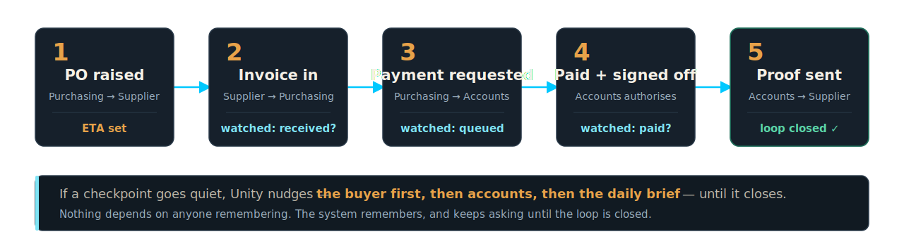
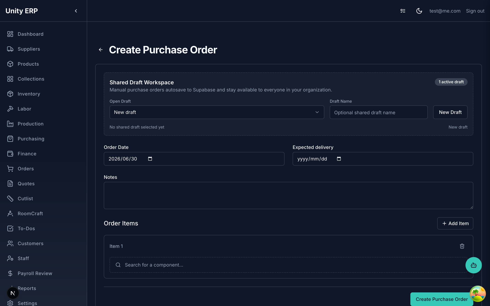
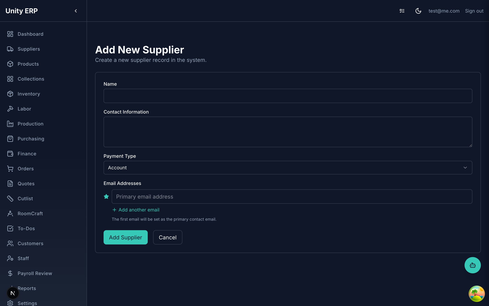
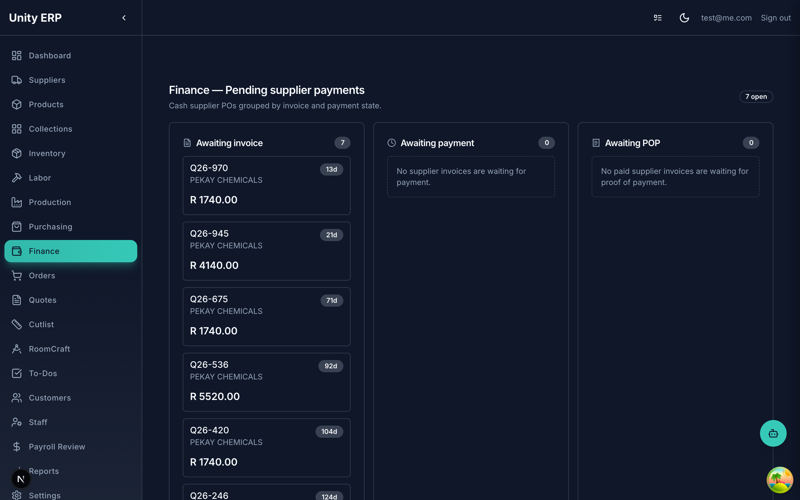

<!-- _class: cover -->

# Cash-Supplier Tracking

*How it works — from order placed to proof of payment.*

---

<!-- _class: quote-only -->

# It's rarely the order that fails. It's the invoice.

The order goes out fine. What stalls is the paperwork behind it — the invoice that arrives and quietly never gets processed, or never arrives at all. Nothing tells you, until the bench goes quiet.

---

<!-- _class: faults -->

# Where a cash order goes quiet.

<ol>
<li>The invoice <strong>arrives — but never gets processed</strong>. most common</li>
<li>The invoice is <strong>never sent</strong> after the order is placed.</li>
<li>It's processed — but <strong>never paid</strong>.</li>
<li>It's paid — but the <strong>proof of payment is never sent</strong> to the supplier.</li>
</ol>

Every one of these is invisible today — it depends on someone remembering. Unity now watches all four, and nudges the moment one stalls.

---

> ## "The invoice came in three weeks ago. It's still sitting in an inbox — unprocessed."

The order was placed and the invoice arrived. Then it stalled — never processed, never paid. The supplier waits, the bench goes quiet, and only then does anyone notice.
→ Unity makes the stall visible the day it happens.

---

<!-- _class: diagram -->

# The cash-supplier loop, end to end.

Five checkpoints between placing the order and closing the loop. Unity watches every one — and the moment a stage goes quiet, it nudges.

---

<!-- _class: shot -->

# 1. Set an expected date when you place the order.

A new **Expected delivery** field sits beside Order Date — prefilled from the supplier's lead time, fully editable. Every order now carries a date Unity can watch.

---

<!-- _class: shot -->

# 2. Mark a cash supplier once.

On the supplier, set **Payment Type** to *Cash* or *Account*. Cash suppliers flow into the payment watch automatically; everything defaults to Account, so nothing changes until you choose.

---

> ## 3. Every pending payment, on one screen.

The new <strong>Finance → Pending supplier payments</strong> board groups cash orders by state — <em>Awaiting invoice</em>, <em>Awaiting payment</em>, <em>Awaiting POP</em> — with the supplier, amount, and how many days it has been waiting.
→ The whole queue, at a glance. Nothing hides in an inbox.

---

> ## "The invoice is in — but is it actually moving?"

The moment a cash order is placed, Unity knows an invoice is due and starts the clock — then watches that it's received, <strong>processed</strong>, and paid. If any step stalls, it speaks up — quietly at first, then louder.
→ Received. Processed. Paid. Nothing skipped.

---

> ## "First the buyer. Then accounts. Then the daily brief."

A stalled invoice doesn't sit in silence. It moves up — a nudge to the buyer who placed it, then to accounts, then onto the morning brief — until the loop is closed.
→ They notice. They push. They escalate.

---

> ## "Pay, sign off, and drop the proof on the order — done."

Accounts records the payment, signs it off, and attaches the proof of payment straight onto the order. The supplier is told, from inside Unity — and the loop closes.
→ Owed. Paid. Signed off. Sent.

---

<!-- _class: status -->

# Where we are.

### Working now
- **Cash / Account** flag on every supplier
- **Expected delivery** captured at order time, with overdue flags on the order list
- **Finance board** — every cash order grouped by payment state

### Rolling out next
- Mark an invoice **received → processed → paid → signed off**, with a full audit trail
- **Drag-and-drop** proof of payment onto an order
- **Escalating reminders** — buyer → accounts → daily brief
- Send proof of payment by email from inside Unity

---

> ## "Everything present. The team starts on time."

When the paperwork keeps pace with the order, the bench is never waiting on a missing box — and the cause is never a forgotten or unprocessed invoice.
→ Nothing waiting. Nothing forgotten.

---

<!-- _class: cover -->

# Polygon

*Unity ERP is the spine. AI agents are the nervous system.*
*Made for manufacturers who want their factory to stay tight.*
