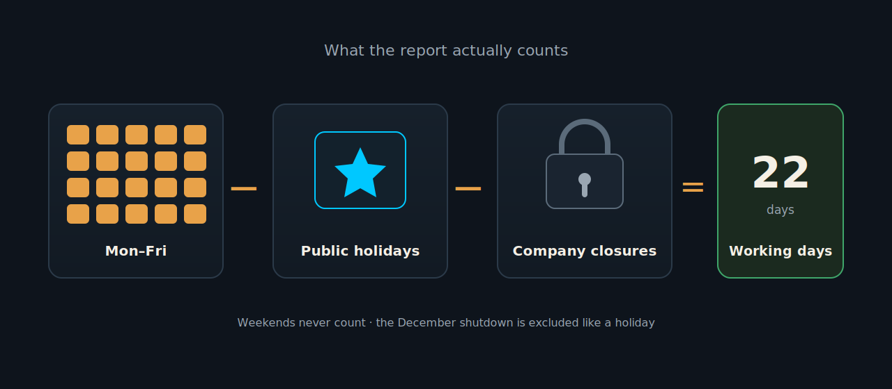
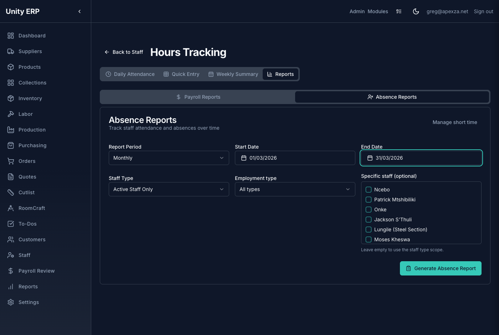
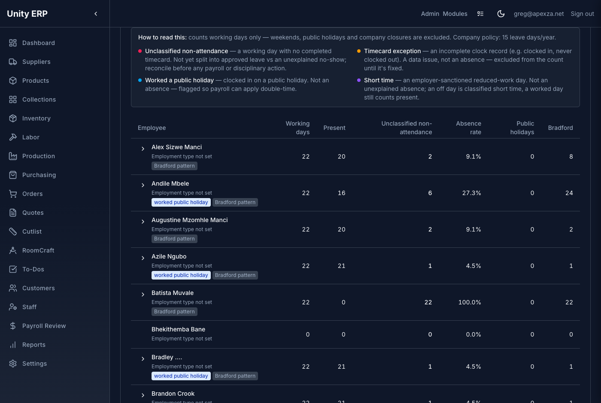
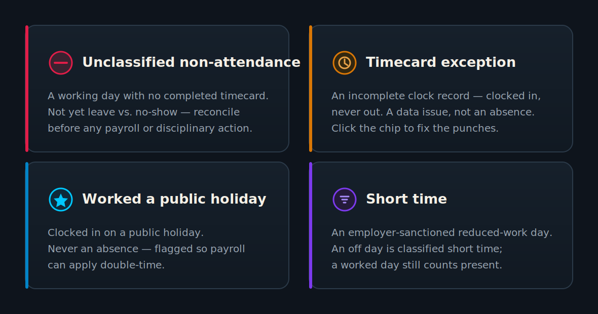
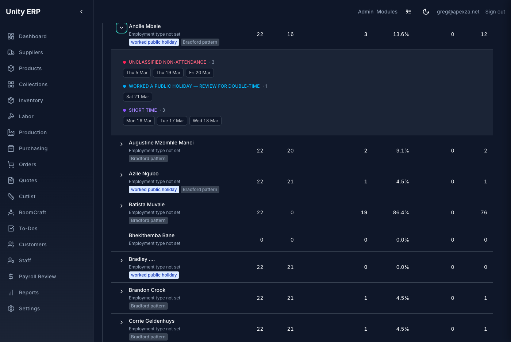
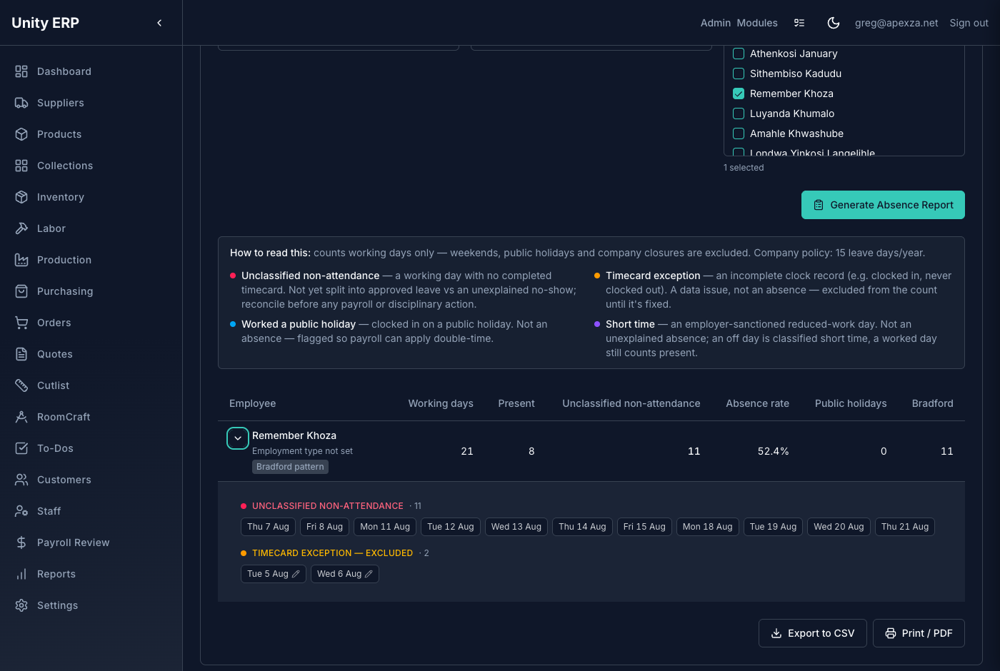
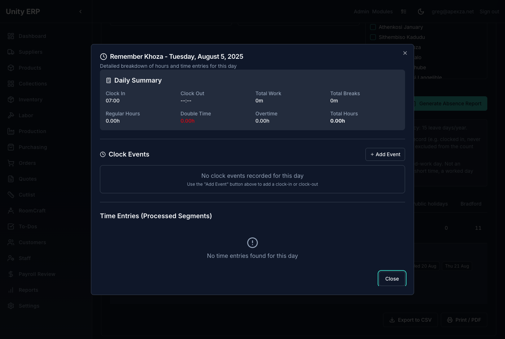
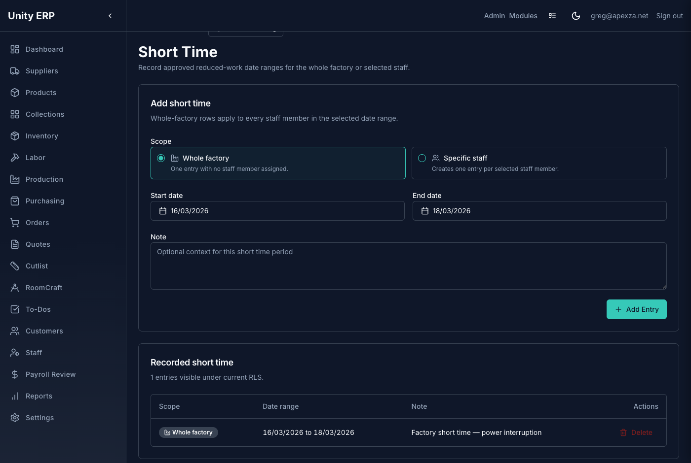
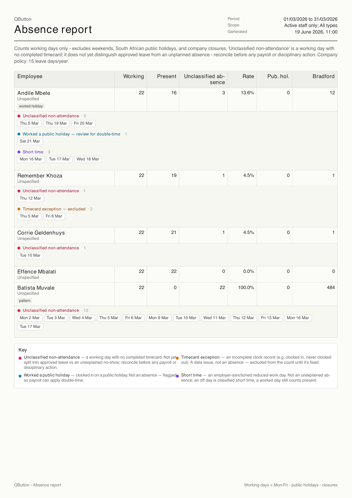

<!-- _class: cover -->

# Monthly Staff Absence Report

*Who was genuinely, unexpectedly absent — and nothing else.*

PREPARED FOR QBUTTON · UNITY ERP · HOURS TRACKING

---

<!-- _class: quote-only -->

# It counts the days that **actually matter** — not weekends, not public holidays, not the December shutdown.

The old report counted every calendar day with no hours as "absent," so weekends and holidays inflated the number by ~100 days a year. This report counts **working days only**.

Phase A reports **unclassified non-attendance** — it cannot yet tell approved leave from a no-show, so always reconcile before any payroll or disciplinary action.

---

<!-- _class: diagram -->

# What "working days" means

Each person gets **15 leave days a year**, taken together over the **December shutdown** — so the shutdown is excluded like a holiday, and December doesn't show everyone as "absent."

---

<!-- _class: shot -->

# 1. Open the report and set the period

Go to **Hours Tracking → Reports → Absence Reports**. Pick **Monthly** (or any range), set the **dates**, choose a **Staff Type** (Active is the default), and optionally **Employment type → Monthly** or specific staff. Then **Generate Absence Report**.

---

<!-- _class: shot -->

# 2. Read the columns

**Working days** in the period, **Present**, **Unclassified non-attendance**, **Absence rate**, **Public holidays** excluded, and the **Bradford** pattern score. The coloured **Key** at the top explains every flag.

---

<!-- _class: diagram -->

# The Key — four things that are *not* a plain absence

Each shows as a coloured chip when you open a row. Only **unclassified non-attendance** counts toward the absence total.

---

<!-- _class: shot -->

# 3. Open a row — the weekday chips

Click the **chevron** beside a name to see exactly *which* days. Each chip is one weekday, grouped and colour-coded — so "6 absences" becomes six dates you can actually check.

---

<!-- _class: shot -->

# 4. A timecard exception? Fix it in place

An **amber** chip is an incomplete clock record (clocked in, never out) — a data issue, **not** an absence, so it's left out of the count. The pencil icon means it's clickable.

---

<!-- _class: shot -->

# 4. …the clock-edit dialog opens right there

Clicking the chip opens the day's **clock record** — add the missing clock-out (or fix the punches), close, and the report refreshes. The exception clears once the timecard is complete.

---

<!-- _class: shot -->

# 5. Record short time

From the report header, open **Manage short time** (`/staff/short-time`). Choose **Whole factory** or **specific staff**, set the **dates**, add a note, and **Add Entry**. Off days in that range become **short time**, not unexplained absence; worked days still count present. *(Admin only.)*

---

<!-- _class: shot -->

# 6. Print or export

**Print / PDF** gives a clean, dated document — company, period, scope, the full table with coloured detail, and the Key — ready to file or hand over. **Export to CSV** gives the same data for a spreadsheet.

---

<!-- _class: quote-only -->

# Before you act on a number, read it correctly.

**Unclassified non-attendance** is *not* the same as an unauthorised absence — it simply means a working day with no completed timecard. Approved leave that isn't recorded yet still shows here.

Reconcile each flagged day against leave forms and short time **before** any payroll or disciplinary decision. Full leave-vs-no-show classification arrives in **Phase B**.

---

<!-- _class: cover -->

# One number you can trust.

*Working days in, weekends and holidays out — every flag explained, every day checkable.*

QBUTTON · UNITY ERP

